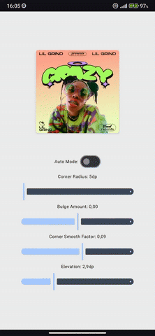

# BulgedComposeShaper 


**BulgedComposeShaper** is a tiny UI building block for Jetpack Compose:  
it gives you a custom **curved shape** and a **Composable** that reacts to touch and clicks.

Use it to create more organic, dynamic, and visually expressive layouts with minimal setup.

This shape can be applied to any `Composable` (like `Card`, `Surface`, or `Box`) to give your UI a soft, modern, and elegant visual identity.

---

## 🚀 Features

- 🎯 **Custom Bulged Shape**  
  `BulgedRoundedRectangleShape` lets you control both the **corner radius** and **edge curvature** (`bulgeAmount`) independently.  
  Use positive values to **bulge** outward, or negative ones to **cave** inward.

- 🧩 **Seamless Compose Integration**  
  Works with all `shape`-enabled composables like `Card`, `Surface`, `Box`, and custom layouts.

- ✋ **Perfect Clipping for Images**  
  Scale your bitmap (1.05–1.25x) with `ContentScale.Crop` for flawless clipping inside the bulged shape.

- 🖼️ **Ready-to-use ClippedImage Composable**  
  Handles scaling and clipping automatically.

---

## 📸 Screenshots

| Bulged Shape Morphing | Shape Preview 1 | Shape Preview 2 | Touch Interaction |
|:---:|:---:|:---:|:---:|
|  |  |   |   |

---

## 🧪 Usage Example

```kotlin
val customShape = remember {
    BulgedRoundedRectangleShape(
        cornerRadius = 25.dp,
        bulgeAmount = 0.03f // value between 1.0 and -1.0 : Positive = bulge, Negative = cave   
    )
}

Card(
    modifier = Modifier
        .width(310.dp)
        .height(310.dp),
    shape = customShape,
    colors = CardDefaults.cardColors(containerColor = Color(0xFFBABABA)),
    elevation = CardDefaults.cardElevation(6.dp)
)
```

for Images:

```kotlin
BulgedImage(
    bitmap = myBitmap,
    contentDescription = "Sample",
    contentScale = ContentScale.Crop, // Critical!
    shape = BulgedRoundedRectangleShape(20.dp, 0.02f)
)
```

## 🔮 Roadmap (WIP)

- 🖐️ **Touch-Based Shape Deformation**  
  Animate and morph the shape in response to user interactions, such as touch position or pressure.  
  Goal: create an organic, responsive surface.

- 🎛️ **Interactive Playground UI**  
  A live preview screen with sliders to tweak `cornerRadius` and `bulgeAmount` values in real time, helping designers/devs quickly prototype the shape.

- 🎨 **Multiple Shape Variants**  
  Explore variations like fully circular bulged shapes or asymmetric curves per edge.

- ⚙️ **Composable Modifier Extensions**  
  Provide utility functions like `.bulgedClip()` or `.bulgedBackground()` for even easier integration.


---

## 📦 Requirements

- **Android Studio** (Giraffe or newer recommended)  
- **Kotlin**  
- **Jetpack Compose**  

---

## 📸 Preview (coming soon)

A visual example or animated demo will be added here soon.  
Stay tuned 👀

---

## ✨ Why this project?

Default shapes in Compose are flat and rigid.  
**BulgedComposeShaper** gives your UI a new visual language: one that’s soft, tactile, and full of subtle character.

It’s a small detail — but it **feels** different.  
And that’s the point.

---

Made with ❤️
